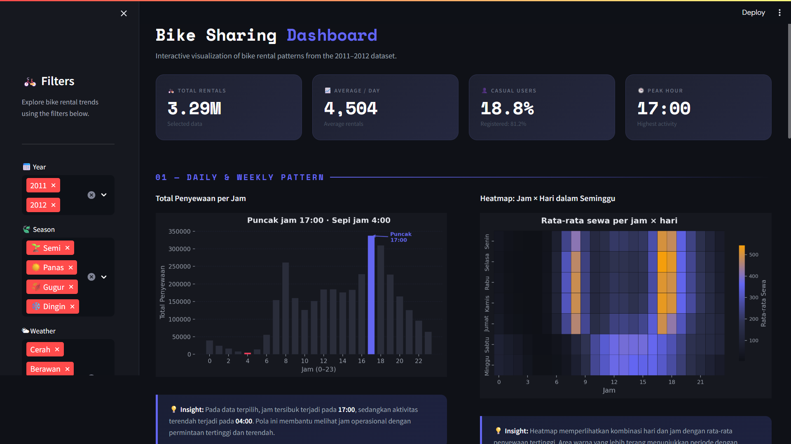

# 🚲 Bike Sharing Dashboard

Interactive Streamlit dashboard for analyzing bike-sharing rental patterns based on daily and hourly rental data from 2011–2012.

This project explores rental behavior across different time periods, user types, weather conditions, and seasons. The dashboard provides visual insights to help understand when and why bike rental demand changes.

---

## 📌 Overview

Bike-sharing systems generate large amounts of usage data that can be analyzed to understand user behavior and demand patterns.

This dashboard was built to explore several important questions, such as rental trends by hour, day, month, weather condition, season, and user type. The analysis is presented through interactive filters and data visualizations using Python and Streamlit.

---

## ❓ Business Questions

This project focuses on the following questions:

1. When do bike rentals reach their peak hours?
2. How do rental patterns differ between weekdays and weekends?
3. How did bike rental trends change from 2011 to 2012?
4. How do casual users and registered users differ in their rental behavior?
5. How do weather conditions affect average bike rentals?
6. Which season has the highest total bike rentals?

---

## 📊 Dashboard Preview



---

## 📁 Dataset

The dataset used in this project contains bike-sharing rental records from 2011 to 2012.

The project uses two main files:

- `day.csv` — daily bike rental data
- `hour.csv` — hourly bike rental data

Main variables used in the dashboard include:

- `dteday` — date
- `season` — season category
- `weathersit` — weather condition
- `hr` — hour of the day
- `casual` — number of casual users
- `registered` — number of registered users
- `cnt` — total bike rentals

---

## ✨ Dashboard Features

The dashboard includes:

- Interactive sidebar filters
- Year filter
- Season filter
- Weather condition filter
- Hour range filter
- KPI cards for total rentals, daily average, casual users, and peak hour
- Hourly rental pattern visualization
- Weekday and hourly heatmap
- Monthly rental trend chart
- Casual vs registered user comparison
- Weather impact visualization
- Seasonal rental comparison
- Data preview table

---

## 🔍 Key Insights

Based on the dashboard analysis:

- Bike rental activity tends to peak during commuting hours.
- Weekday usage shows stronger morning and evening patterns.
- Weekend usage tends to be more evenly distributed throughout the day.
- Registered users contribute more consistently to total rentals.
- Casual users show higher activity during warmer months.
- Better weather conditions are associated with higher average rental activity.
- Seasonal patterns show differences in total rental demand across the year.

---

## 🛠️ Tech Stack

This project was built using:

- Python
- Streamlit
- Pandas
- NumPy
- Matplotlib
- Seaborn

---

## 📂 Project Structure

```text
Bike Sharing Dashboard/
│
├── assets/
│   └── dashboard-preview.png
│
├── dashboard/
│   ├── app.py
│   ├── charts.py
│   ├── components.py
│   ├── style.py
│   └── utils.py
│
├── data/
│   ├── day.csv
│   └── hour.csv
│
├── notebook.ipynb
├── README.md
├── requirements.txt
└── .gitignore

## 🚀 How to Run Locally

### 1. Clone this repository

```bash
git clone https://github.com/faalvaro/Bike-Sharing-Dashboard.git
```

### 2. Go to the project directory

```bash
cd Bike-Sharing-Dashboard
```

### 3. Create and activate a virtual environment

For Windows:

```bash
python -m venv .venv
.venv\Scripts\activate
```

For macOS/Linux:

```bash
python -m venv .venv
source .venv/bin/activate
```

### 4. Install dependencies

```bash
pip install -r requirements.txt
```

### 5. Run the Streamlit app

```bash
streamlit run dashboard/app.py
```

---

## 🌐 Live Demo

The dashboard can be accessed here:

[Bike Sharing Dashboard - Streamlit App](https://bike-sharing-dashboard-2011-2012.streamlit.app/)


---

## 👤 Author

**Farhan Ahmad Alvaro**

- GitHub: [faalvaro](https://github.com/faalvaro)
- LinkedIn: [Farhan Ahmad Alvaro](https://www.linkedin.com/in/farhan-ahmad-alvaro/)

---

## 📌 Notes

This project was created as part of a data analysis learning project. The dashboard focuses on exploratory data analysis and interactive data visualization using Streamlit.

```text

```